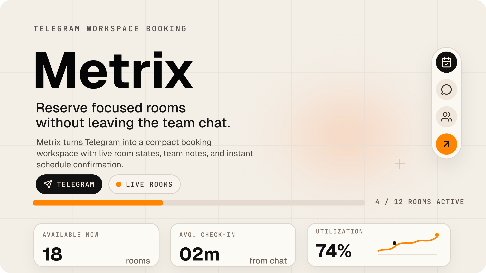

# Metrix

Metrix — платформа для бронирования коворкинговых и офисных ресурсов: рабочих мест, переговорных, кабинетов и залов. В проекте есть публичное web-приложение на Next.js, Telegram-бот, микросервисный backend, платежный контур, календарные интеграции, аналитика, audit/RBAC, OpenAPI-контракты, мониторинг и эксплуатационные runbook'и.

[Сайт](https://metrixplatform.vercel.app) · [Документация](./docs/README.md) · [OpenAPI](./docs/openapi/README.md) · [Инженерный отчет](./docs/REPORT.md)


## Что делает проект

Metrix заменяет ручное управление бронями в чатах, таблицах и админских переписках единым потоком:

- пользователь выбирает локацию, ресурс и свободный слот через сайт или Telegram;
- Telegram-бот ведет сценарии бронирования, оплаты, отмены, переноса и просмотра записей;
- администратор управляет ресурсами, статусами, аналитикой, восстановлением очередей и платежными сагами;
- платежи проходят через Telegram/YooKassa-совместимый invoice-flow с hold/confirm/cancel логикой;
- календарный сервис хранит интеграции с внешними календарями и шифрует токены;
- аналитика считает utilization, summary-метрики, отчеты и статистику;
- операционный слой дает health/readiness, метрики Prometheus, Grafana-дашборды, audit log, DLQ replay, backup и incident/recovery процедуры.

## Стек

- Язык: TypeScript, JavaScript для dashboard-сервиса.
- Frontend: Next.js 16, React 19, Tailwind CSS 4, Radix UI, shadcn-подобные UI-примитивы, lucide-react, Recharts, Sonner.
- Backend: Node.js, встроенный `node:test`, `tsx`, микросервисы в `apps/bot/services`.
- База данных: PostgreSQL, Prisma, PgBouncer.
- Очереди и временное состояние: Redis, Redis Streams, BullMQ, locks, idempotency, rate limits, replay protection, DLQ.
- API-контракты: OpenAPI 3.1 YAML, TypeScript contracts, Zod/ручные validators.
- Auth/security: HMAC service-to-service подписи, signed user identity, JWT, RBAC, audit log, security headers, rate limiting.
- Observability: Prometheus text metrics, Grafana, structured JSON logs, trace context, `/health`, `/ready`, `/metrics`.
- Error tracking: self-hosted GlitchTip, Sentry-compatible SDK wrapper `@metrix/error-tracker`.
- Object storage: MinIO/S3-compatible storage для отчетов и будущих файлов.
- Reverse proxy: Traefik v3 с middleware для secure headers и rate limit.
- Tooling: npm workspaces, TypeScript strict/typecheck, ESLint для web, Husky hooks, Docker Compose.

## Структура репозитория

```txt
apps/web
  Next.js web-приложение, лендинг, страницы продукта, UI-kit, booking UI.

apps/bot
  Telegram bot runtime, микросервисы, shared packages, docker-compose.

apps/bot/services
  bot-gateway, booking-service, payment-service, calendar-service,
  analytics-service, admin-service, security-service, notification-service,
  worker-service, dashboard.

apps/bot/packages
  audit-log, auth, contracts, error-tracker, health, observability,
  rbac, redis-bus, storage.

packages/api
  Общий backend API-блок: доменные модули, contracts, queues, realtime.

prisma
  Корневая Prisma-схема, миграции и seed.

docs
  Архитектура, OpenAPI, эксплуатация, безопасность, тестирование, решения.

tests
  Unit, integration и e2e тесты.

monitoring
  Prometheus scrape config, Grafana provisioning и дашборды.

traefik
  Статическая и динамическая конфигурация reverse proxy.

scripts
  Вспомогательные скрипты: backup PostgreSQL, валидация OpenAPI.
```

## Архитектура

```txt
Web / Telegram
  -> apps/web или bot-gateway
  -> booking-service
  -> payment-service
  -> calendar-service
  -> analytics-service
  -> admin-service / security-service
  -> PostgreSQL + Redis + MinIO
  -> Prometheus + Grafana + GlitchTip
```

Основной пользовательский путь:

1. Пользователь открывает сайт или Telegram-бота.
2. `bot-gateway` принимает Telegram update или web UI обращается к backend-контрактам.
3. `booking-service` отдает локации, ресурсы и слоты, ставит locks и создает бронь.
4. `payment-service` создает invoice/hold и подтверждает или отменяет оплату.
5. `calendar-service` синхронизирует внешние календарные события.
6. `notification-service` отправляет Telegram-уведомления.
7. `analytics-service` получает события и обновляет статистику.
8. `admin-service` дает операторам audit, DLQ replay, recovery и внутренние действия.

Полезные документы:

- [Обзор системы](./docs/architecture/SYSTEM_OVERVIEW.md)
- [Модули](./docs/architecture/MODULES.md)
- [Диаграммы](./docs/architecture/DIAGRAMS.md)
- [API-контракты](./docs/architecture/API_CONTRACTS.md)
- [Очереди и события](./docs/architecture/QUEUES_AND_EVENTS.md)
- [Безопасность](./docs/architecture/SECURITY.md)
- [Production readiness](./docs/architecture/PRODUCTION_READINESS.md)

## Web-приложение
 
`apps/web` — публичная часть продукта:

- главная страница и маркетинговые страницы;
- booking explorer;
- страницы API, статуса, компании, legal, FAQ, changelog;
- компонентная система `components/ui`;
- изображения и демонстрационные экраны в `public/metrix`, `public/screen`, `public/images`.

Основные зависимости web:

- `next`, `react`, `react-dom`;
- `@radix-ui/*` для доступных UI-примитивов;
- `lucide-react`, `@hugeicons/react` для иконок;
- `react-hook-form`, `zod`, `@hookform/resolvers`;
- `recharts`, `date-fns`, `embla-carousel-react`;
- `next-themes`, `sonner`, `tailwind-merge`, `class-variance-authority`.

Команды:

```bash
npm run dev:web
npm --prefix apps/web run dev
npm --prefix apps/web run lint
npm --prefix apps/web run typecheck
npm --prefix apps/web run build
npm --prefix apps/web run start
```

## Telegram-бот и микросервисы

`apps/bot` — не один скрипт бота, а локальный runtime из сервисов:

- `bot-gateway` — Telegram updates, публичные bot flows, HMAC-запросы к сервисам.
- `booking-service` — локации, ресурсы, слоты, брони, locks, idempotency, completion/reminder scheduling.
- `payment-service` — invoices, holds, payment saga, компенсации, взаимодействие с booking-service.
- `calendar-service` — calendar connections, OAuth, encrypted tokens, sync.
- `analytics-service` — summary, utilization, reports, event consumers.
- `admin-service` — админские endpoints, audit views, DLQ replay, payment recovery.
- `security-service` — JWT, sessions, token blacklist, login rate limit.
- `notification-service` — потребление событий и Telegram notifications.
- `worker-service` — фоновые задачи: reminders, booking completion, calendar refresh, reports.
- `dashboard` — локальная operational dashboard-панель.

Shared packages:

- `@metrix/audit-log` — запись, запросы и retention audit-событий.
- `@metrix/auth` — HMAC service signatures, signed user id, request body helpers, trace.
- `@metrix/contracts` — типизированные события и публичные контракты.
- `@metrix/error-tracker` — обертка над Sentry-compatible error tracking.
- `@metrix/health` — health/readiness checks для Prisma и Redis.
- `@metrix/observability` — metrics registry, observed HTTP handlers, `/metrics`, graceful shutdown.
- `@metrix/rbac` — роли, permissions, actor evaluation.
- `@metrix/redis-bus` — Redis Streams, event bus, DLQ, slot locking.
- `@metrix/storage` — MinIO/S3 storage client и buckets.

Команды:

```bash
npm run dev:bot
npm --prefix apps/bot run dev
npm --prefix apps/bot run dev:win
npm --prefix apps/bot run down
npm --prefix apps/bot run build
npm --prefix apps/bot run typecheck
npm --prefix apps/bot run db:generate
npm --prefix apps/bot run db:migrate
```

## Инфраструктура Docker Compose

Локальный compose-файл находится в [apps/bot/docker-compose.yml](./apps/bot/docker-compose.yml).

Поднимаемые сервисы:

- `postgres` — основная база PostgreSQL 16.
- `pgbouncer` — connection pooling.
- `redis` — queues, streams, locks, rate limits.
- `db-init` — Prisma push и post-init SQL.
- `booking-service`, `calendar-service`, `payment-service`, `analytics-service`, `admin-service`, `security-service`, `bot-gateway`, `notification-service`, `worker-service`.
- `dashboard` — локальная панель.
- `prometheus` — сбор метрик.
- `grafana` — визуализация метрик.
- `glitchtip` — error tracking.
- `minio` — объектное хранилище.
- `traefik` — reverse proxy.

Локальные адреса через Traefik:

- `http://dashboard.localhost` — operational dashboard.
- `http://grafana.localhost` — Grafana.
- `http://errors.localhost` — GlitchTip.
- `http://minio.localhost` — MinIO Console.
- `http://minio-api.localhost` — MinIO API/presigned URLs.
- `http://bot.localhost` — Telegram webhook endpoint для локального routing.
- `http://localhost:8080` — Traefik dashboard.

## Быстрый старт

Установка из корня:

```bash
npm install
```

Запуск web:

```bash
npm run dev:web
```

Запуск bot runtime:

```bash
cd apps/bot
cp .env.example .env
npm install
npm run dev
```

Перед запуском Docker Compose заполните `.env`: `POSTGRES_PASSWORD`, `REDIS_PASSWORD`, `TELEGRAM_BOT_TOKEN`, signing secrets, `GRAFANA_ADMIN_PASSWORD`, MinIO credentials и другие значения из `.env.example`.

## Основные команды из корня

```bash
npm run build
npm run build:api
npm run build:bot
npm run build:web
npm run dev:api
npm run dev:bot
npm run dev:web
npm run lint
npm run typecheck
npm run typecheck:api
npm run typecheck:bot
npm run typecheck:web
npm run test
npm run test:unit
npm run test:integration
npm run test:e2e
npm run openapi:validate
npm run prisma:generate
npm run prisma:migrate
npm run prisma:validate
npm run prisma:seed
npm run db:backup
npm run audit:security
npm run verify
```

## Тесты и quality gates

Тесты лежат в [tests](./tests/README.md) и запускаются через встроенный `node:test` + `tsx`.

Команды:

```bash
npm test
npm run test:unit
npm run test:integration
npm run test:e2e
npm run typecheck
npm run openapi:validate
npm run verify
```

Что покрыто:

- unit: validators, contracts, bot messages/callbacks/session store, slots, audit log, structured logger, payment guards/split, calendar token encryption, production hardening;
- integration: booking, calendar, payment, smoke;
- e2e: smoke и booking flow;
- contract/API checks: OpenAPI validation и public contracts tests;
- production readiness: проверки вокруг Docker, health, metrics, incidents и recovery описаны в `docs/testing`.

Список текущих test-файлов:

```txt
tests/unit/api/booking-events.test.ts
tests/unit/api/booking-validators.test.ts
tests/unit/api/public-contracts.test.ts
tests/unit/audit/audit-log.test.ts
tests/unit/bot/callback-data.test.ts
tests/unit/bot/messages.test.ts
tests/unit/bot/slots.test.ts
tests/unit/bot/telegram-update-store.test.ts
tests/unit/bot/user-session-store.test.ts
tests/unit/calendar/token-encryption.test.ts
tests/unit/logger/logger.test.ts
tests/unit/payment/payment-flow-guards.test.ts
tests/unit/payment/payment-split.test.ts
tests/unit/production-hardening-next.test.ts
tests/integration/booking.test.ts
tests/integration/calendar.test.ts
tests/integration/payment.test.ts
tests/integration/smoke.test.ts
tests/e2e/booking-flow.test.ts
tests/e2e/smoke.test.ts
```

Git hooks:

- `npm run hook:pre-commit` запускает `typecheck:api` и `typecheck:web`;
- `npm run hook:pre-push` запускает security audit, тесты и OpenAPI validation.

## OpenAPI и API-контракты

OpenAPI-спецификация:

- [docs/openapi/metrix-bot-api.yaml](./docs/openapi/metrix-bot-api.yaml)
- [docs/openapi/README.md](./docs/openapi/README.md)
- [docs/openapi/PREVIEW.md](./docs/openapi/PREVIEW.md)

Проверка:

```bash
npm run openapi:validate
```

Правило проекта: при изменении API нужно синхронно обновлять:

- OpenAPI YAML;
- TypeScript contracts в `apps/bot/packages/contracts` и/или `packages/api/src/contracts`;
- validators;
- тесты;
- документацию в `docs/api` или `docs/architecture/API_CONTRACTS.md`.

## Метрики, логи и мониторинг

Каждый HTTP-сервис должен отдавать:

- `/health` — процесс жив;
- `/ready` — сервис готов обрабатывать запросы и видит критичные зависимости;
- `/metrics` — Prometheus text format.

Пакет `@metrix/observability` дает:

- `MetricsRegistry`;
- счетчики HTTP-запросов;
- histogram latency buckets;
- normalized route labels;
- `sendMetrics`;
- `sendReadiness`;
- `createObservedHandler`;
- graceful shutdown для `SIGTERM` и `SIGINT`.

Пакет `@metrix/logger` дает:

- JSON logs: одна запись — одна строка;
- обязательные поля `level`, `timestamp`, `service`, `env`, `hostname`, `pid`, `message`;
- автоматическую корреляцию с OpenTelemetry через `traceId` и `spanId`;
- безопасную сериализацию `Error`;
- вывод `error` в stderr, `info/warn` в stdout.

Примеры метрик:

```txt
metrix_process_uptime_seconds{service="booking-service"} 3600
metrix_http_requests_total{service="booking-service",method="POST",route="/bookings",status="200"} 142
metrix_http_request_duration_ms_bucket{service="booking-service",le="100"} 130
metrix_http_request_duration_ms_count{service="booking-service"} 142
metrix_http_request_duration_ms_sum{service="booking-service"} 4521.3
```

Prometheus:

- конфиг: [monitoring/prometheus/prometheus.yml](./monitoring/prometheus/prometheus.yml);
- scrape interval: 15 секунд;
- retention: 15 дней.

Grafana:

- provisioning: [monitoring/grafana/provisioning](./monitoring/grafana/provisioning);
- dashboard: [monitoring/grafana/dashboards/metrix-overview.json](./monitoring/grafana/dashboards/metrix-overview.json);
- основной дашборд: `Metrix — Overview`;
- панели: RPS по сервисам, p95 latency, 5xx error rate, process uptime, booking/payment breakdown.

Logging:

- Loki хранит структурированные логи;
- Vector читает Docker logs, парсит JSON и отправляет записи в Loki;
- low-cardinality labels: `service`, `level`, `env`;
- high-cardinality поля (`requestId`, `userId`, `traceId`, `bookingId`, `paymentId`) остаются в JSON body и ищутся через LogQL.

Документы:

- [Observability](./docs/architecture/OBSERVABILITY.md)
- [Structured logging](./docs/architecture/LOGGING.md)
- [Distributed tracing](./docs/architecture/TRACING.md)
- [Alerting](./docs/architecture/ALERTING.md)
- [Monitoring runbook](./docs/operations/monitoring.md)
- [Error tracking](./docs/operations/error-tracking.md)

## Безопасность

В проекте используются:

- service-to-service HMAC signatures;
- secret rotation через `*_SECRET_NEXT`;
- signed user id;
- JWT key id и previous keys;
- token blacklist;
- login rate limiting;
- Redis replay protection;
- RBAC package;
- audit log;
- security headers и CORS rules;
- Traefik rate limit middleware;
- отдельные `.env.example` для сервисов с least-privilege контрактом.

Документы:

- [Security](./docs/SECURITY.md)
- [Architecture security](./docs/architecture/SECURITY.md)
- [Security service](./docs/architecture/SECURITY_SERVICE.md)
- [Session and token security](./docs/architecture/SESSION_AND_TOKEN_SECURITY.md)
- [Security headers and CORS](./docs/architecture/SECURITY_HEADERS_AND_CORS.md)
- [RBAC and audit](./docs/architecture/RBAC_AND_AUDIT.md)
- [Secret rotation](./docs/architecture/SECRET_ROTATION.md)

## Платежи, календари и отчеты

Платежи:

- `payment-service` управляет invoice/hold/payment saga;
- поддерживается компенсационная логика и recovery через admin-service;
- доменные документы: [Payments and holds](./docs/architecture/PAYMENTS_AND_HOLDS.md).

Календари:

- `calendar-service` хранит OAuth/integration state;
- токены шифруются через `CALENDAR_TOKEN_SECRET`;
- worker-service выполняет refresh/sync задачи;
- документ: [Integrations](./docs/architecture/INTEGRATIONS.md).

Отчеты и файлы:

- worker-service генерирует отчеты;
- MinIO используется как основное S3-compatible хранилище;
- storage package: `@metrix/storage`;
- runbook: [Storage](./docs/operations/storage.md).

## Операционные процедуры

В репозитории есть runbook'и для типовых аварий и обслуживания:

- [Operations overview](./docs/operations/README.md)
- [SLO](./docs/operations/SLO.md)
- [DB restore](./docs/operations/db-restore.md)
- [Redis outage](./docs/operations/redis-outage.md)
- [DLQ replay](./docs/operations/dlq-replay.md)
- [Failed deploy rollback](./docs/operations/failed-deploy-rollback.md)
- [Failure scenarios](./docs/operations/failure-scenarios.md)
- [Traefik](./docs/operations/traefik.md)
- [Backup strategy](./docs/architecture/BACKUP_STRATEGY.md)
- [Zero downtime migrations](./docs/architecture/ZERO_DOWNTIME_MIGRATIONS.md)

Backup PostgreSQL:

```bash
npm run db:backup
```

## Правила разработки

- Для изменений API обновлять contracts, OpenAPI, validators и тесты вместе.
- Unit-тесты не должны ходить в PostgreSQL, Redis, Telegram API, Google Calendar API или платежные API.
- Integration/e2e тесты должны пропускаться при отсутствии нужных env, а не падать из-за локальной среды.
- Важные operational проверки нужно фиксировать как evidence: команда, дата, результат, ошибка, follow-up.
- Production secrets не хранить в репозитории.
- При добавлении сервиса добавить health/readiness/metrics, Prometheus scrape config, Docker Compose env contract и docs.

## Документация

Главные входные точки:

- [docs/README.md](./docs/README.md)
- [docs/architecture/README.md](./docs/architecture/README.md)
- [docs/testing/README.md](./docs/testing/README.md)
- [docs/deployment/README.md](./docs/deployment/README.md)
- [docs/operations/README.md](./docs/operations/README.md)
- [docs/decisions/README.md](./docs/decisions/README.md)
- [docs/openapi/README.md](./docs/openapi/README.md)
