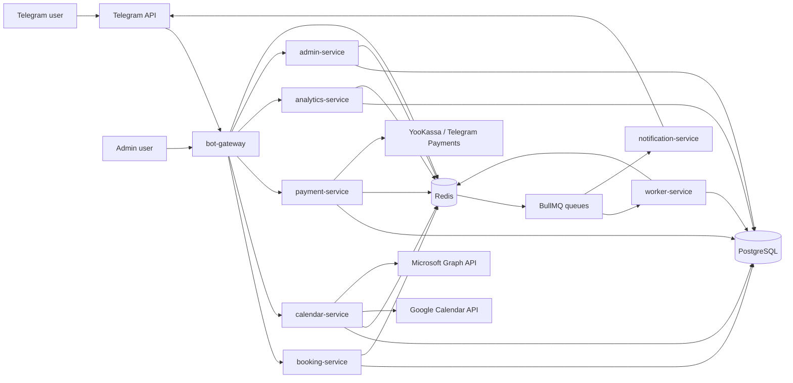
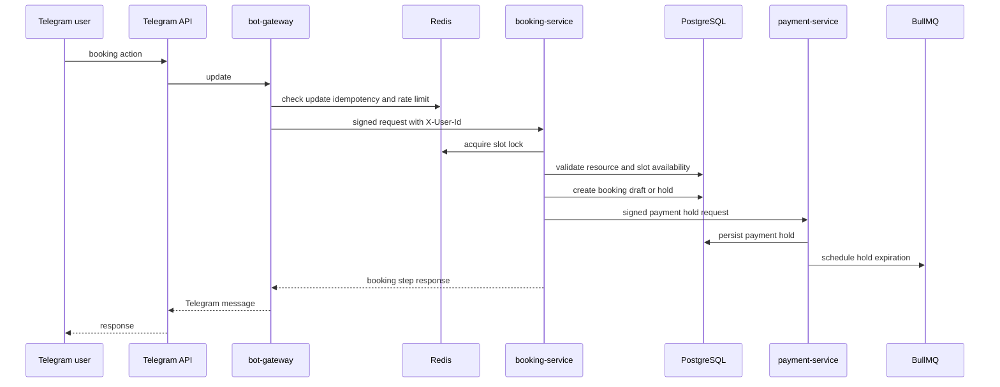
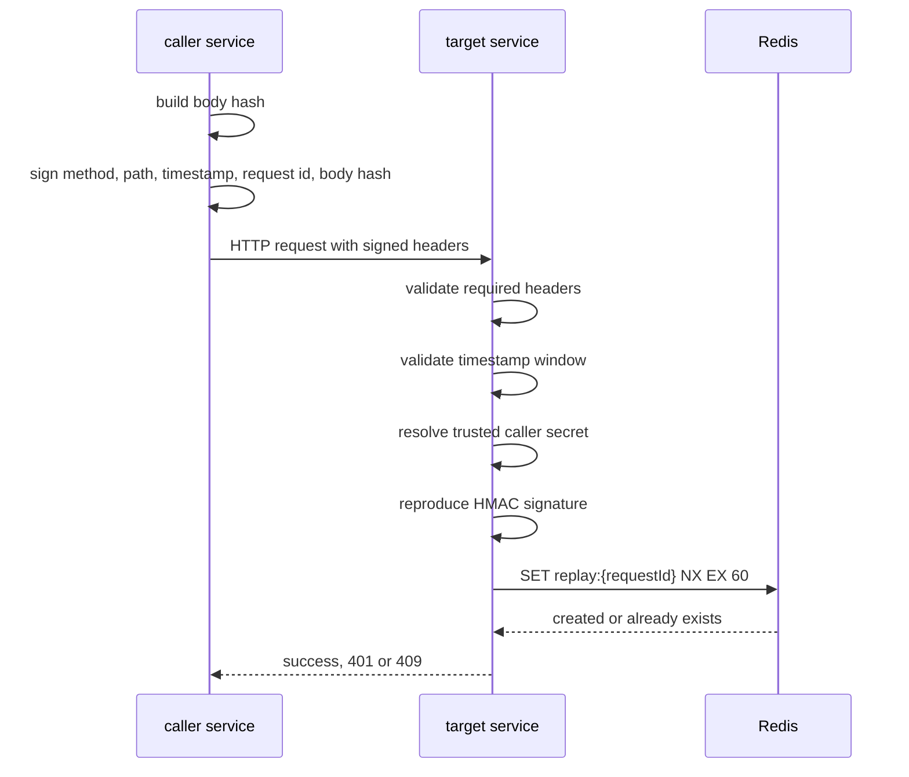
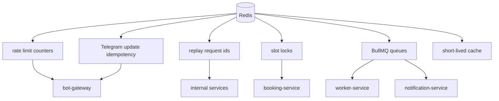
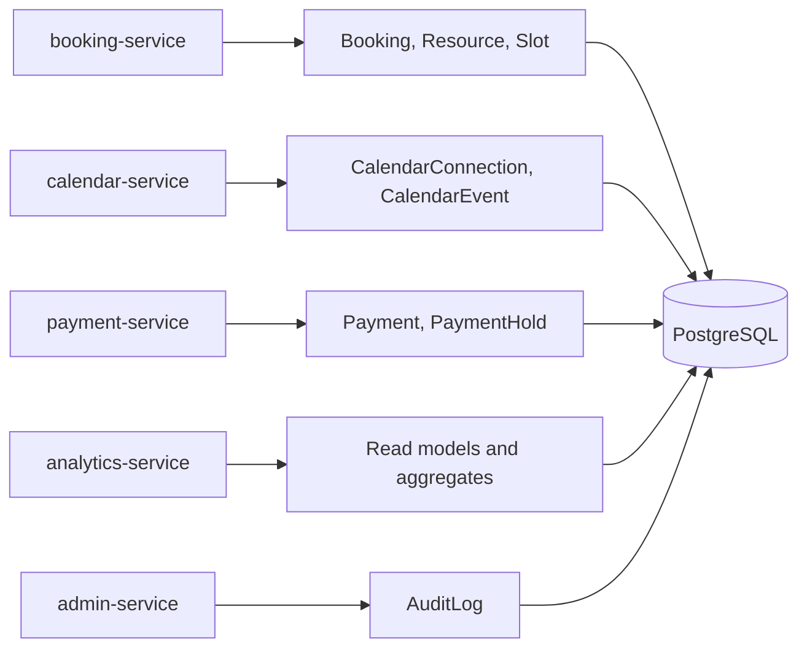
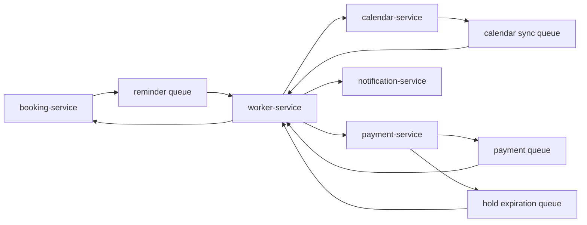

Architecture Diagrams

Этот документ хранит Mermaid-схемы для быстрого понимания системы.
Детали по каждому блоку описаны в отдельных документах architecture.

Назначение

Диаграммы нужны, чтобы показать систему не как набор файлов, а как production-like runtime:

публичные точки входа
внутренние сервисы
потоки запросов
auth и replay protection
Redis
PostgreSQL
queues
external integrations

High-level microservices view

Booking request flow

Service-to-service auth flow

Redis responsibilities

Data ownership

Queue flow

Связанные документы

SYSTEM_OVERVIEW.md
MODULES.md
API_CONTRACTS.md
DATABASE_SCHEMA.md
QUEUES_AND_EVENTS.md
SECURITY.md
DEPLOYMENT.md
